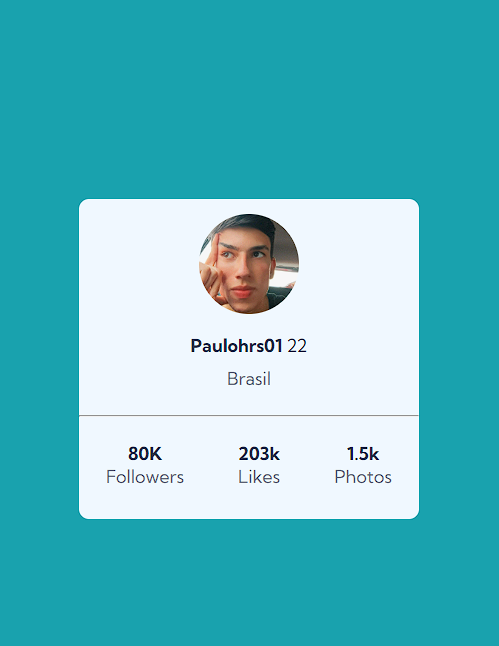
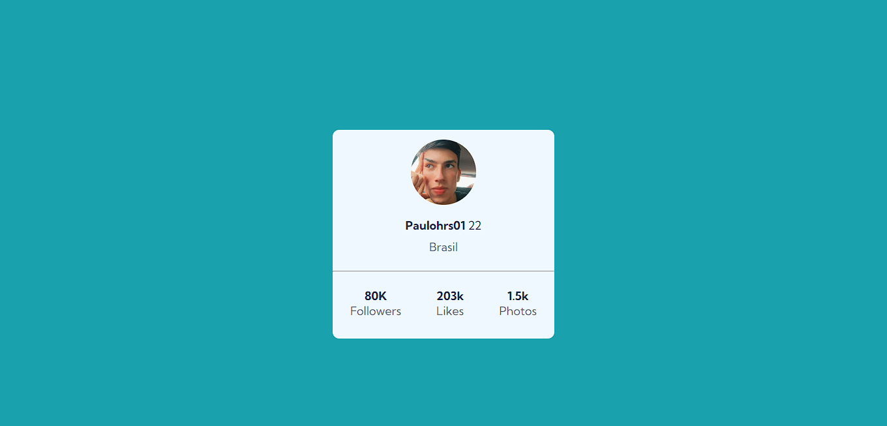

# Projeto Card Profile 👨‍🔧📐
Exercício do Curso DevQuest para treinar Flexbox 📏📐

 

#
## Mobile:

 

## Desktop

#
## Tecnologias utilizadas:
- HTML
- CSS

(praticando HTML e CSS)...

#
# Link: profile-card
https://paulohrs01.github.io/profile-card/

